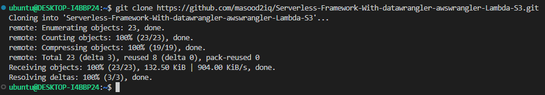
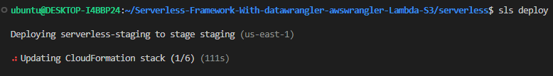
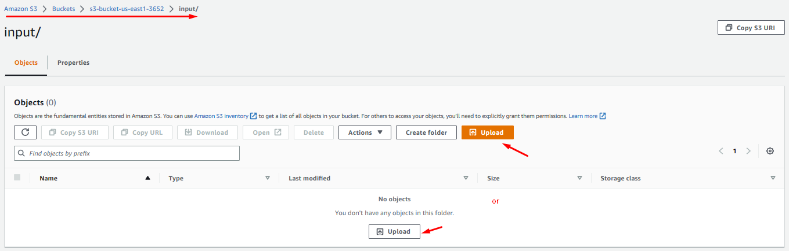
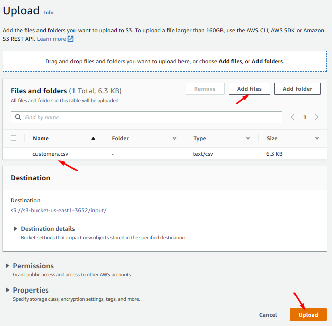

# Serverless Framework With datawrangler/awswrangler with Lambda on existing S3 Bucket


## Overview
Walkthrough on how to deploy `Serverless Framework` on AWS `Data Wrangler` Python Library with an AWS `Lambda Function` triggered while uploading data on an existing S3 bucket and reading/writing data on the same S3.

## Prerequisites
- On AWS account S3 bucket should be created with a unique name.
- `Serverless framework` should be installed and configured.
- AWS account with the user should be configured with the Serverless framework.

For the Serverless and AWS account configuration you can refer to the given [link](
https://github.com/masood2iq/Serverless-Framework-Athena-Glue-S3-Buckets-Deployment.git)

Please follow the steps to walk through the entire process.

### **Step - 1**
----
In S3 bucket create two folders as `input` and `output`. Also upload the `awswrangler-layer-2.18.0-py3.8.zip` file, which you can download from the [link](Releases · aws/aws-sdk-pandas (github.com)).


### **Step - 2**
----
Clone the below given repository in your linux machine `/home` directory with the command.

``` sh
git clone https://github.com/masood2iq/Serverless-Framework-With-datawrangler-awswrangler-Lambda-S3.git
```




This will copy all the related serverless files into the clone directory through which we can proceed further.

### **Step - 3**
----

Go in the clone directory and list all the files as

``` sh
cd Serverless-Framework-With-datawrangler-awswrangler-Lambda-S3/
```

``` sh
ls -al
```


Now, go in the `serverless` directory and list the files as

``` sh
cd serverless/
```

``` sh
ls -al
```


View and edit the `serverless.yml` file and update the S3 bucket name in `custom` resource `S3BucketName`.

``` sh
vim serverless.yml
```

``` yaml
# Welcome to Serverless!
#
# This file is the main config file for your service.
# It's very minimal at this point and uses default values.
# You can always add more config options for more control.
# We've included some commented out config examples here.
# Just uncomment any of them to get that config option.
#
# For full config options, check the docs:
#    docs.serverless.com
#
# Happy Coding!
 
service: ${self:custom.product}-${self:provider.stage}
 
#useDotenv: true
 
# app and org for use with dashboard.serverless.com
#app: your-app-name
#org: your-org-name
 
# You can pin your service to only deploy with a specific Serverless version
# Check out our docs for more details
frameworkVersion: '3'
 
# you can overwrite defaults here
provider:
  name: aws
  region: ${opt:region, 'us-east-1'}                        # change to your region as required
  stage: ${opt:stage, 'staging'}                            # development, stagging, testing, production
#  profile: ${opt:aws-profile, 'ServerlessUser'}
  stackTags:
    Env: ${self:provider.stage}
 
# you can define your custom resources here
custom:
  S3BucketName: bucket-unique-name
  product: serverless
 
# Resources section defines metadata for the Resources.
# Create IAM Role assumed by the crawler. For demonstration, this role is given all related permissions.
resources:
  Resources:
    AWSLambdaRole:
      Type: AWS::IAM::Role
      Properties:
        AssumeRolePolicyDocument:
          Version: "2012-10-17"
          Statement:
            - Effect: "Allow"
              Principal:
                Service:
                  - "lambda.amazonaws.com"
              Action:
                - "sts:AssumeRole"
        Path: "/"
        Policies:
          - PolicyName: AWSLambdaAccess
            PolicyDocument:
              Statement:
                - Effect: Allow
                  Action: lambda:*
                  Resource: '*'
          - PolicyName: AWSS3Access
            PolicyDocument:
              Statement:
                - Effect: Allow
                  Action:
                    - s3:*
                    - s3-object-lambda:*
                  Resource: '*'
          - PolicyName: AWSCloudWatchLogsAccess
            PolicyDocument:
              Statement:
                - Effect: Allow
                  Action:
                    - logs:*
                  Resource: '*'
 
# Create notification on existing S3 bucket
    BucketNotifications:
        Type: Custom::S3BucketNotifications
        Properties:
          ServiceToken:
            Fn::GetAtt:
              - BucketNotificationsHandler
              - Arn
          BucketName: ${self:custom.S3BucketName}
          NotificationConfiguration:
            LambdaFunctionConfigurations:
              - Events:
                  - s3:ObjectCreated:*
                Filter:
                  Key:
                    FilterRules:
                      - Name: suffix
                        Value: .csv
                LambdaFunctionArn:
                  Fn::GetAtt:
                    - AWSLambdaFunction
                    - Arn
          Managed: false
        DependsOn:
          - AllowS3BucketInvokeLambda
 
# Create notification handling on existing S3 bucket
    BucketNotificationsHandler:
        Type: AWS::Lambda::Function
        Properties:
          Description: AWS CloudFormation handler for "Custom::S3BucketNotifications" resources (@aws-cdk/aws-s3)
          Handler: index.handler
          Role:
            Fn::GetAtt:
              - AWSLambdaRole
              - Arn
          Runtime: python3.8
          Timeout: 300
          Code:
            ZipFile: |
              import boto3  # type: ignore
              import json
              import logging
              import urllib.request
              s3 = boto3.client("s3")
              l = boto3.client("lambda")
              CONFIGURATION_TYPES = ["TopicConfigurations", "QueueConfigurations", "LambdaFunctionConfigurations"]
              def handler(event: dict, context):
                  response_status = "SUCCESS"
                  error_message = ""
                  try:
                      props = event["ResourceProperties"]
                      bucket = props["BucketName"]
                      notification_configuration = props["NotificationConfiguration"]
                      request_type = event["RequestType"]
                      managed = props.get('Managed', 'true').lower() == 'true'
                      stack_id = event['StackId']
                      if managed:
                        config = handle_managed(request_type, notification_configuration)
                      else:
                        config = handle_unmanaged(bucket, stack_id, request_type, notification_configuration)
                      put_bucket_notification_configuration(bucket, config)
                  except Exception as e:
                      logging.exception("Failed to put bucket notification configuration")
                      response_status = "FAILED"
                      error_message = f"Error: {str(e)}. "
                  finally:
                      submit_response(event, context, response_status, error_message)
              def handle_managed(request_type, notification_configuration):
                if request_type == 'Delete':
                  return {}
                return notification_configuration
              def handle_unmanaged(bucket, stack_id, request_type, notification_configuration):
                # find external notifications
                external_notifications = find_external_notifications(bucket, stack_id)
                # if delete, that's all we need
                if request_type == 'Delete':
                  return external_notifications
                def with_id(notification):
                  notification['Id'] = f"{stack_id}-{hash(json.dumps(notification, sort_keys=True))}"
                  return notification
                # otherwise, merge external with incoming config and augment with id
                notifications = {}
                for t in CONFIGURATION_TYPES:
                  external = external_notifications.get(t, [])
                  incoming = [with_id(n) for n in notification_configuration.get(t, [])]
                  notifications[t] = external + incoming
                return notifications
              def find_external_notifications(bucket, stack_id):
                existing_notifications = get_bucket_notification_configuration(bucket)
                external_notifications = {}
                for t in CONFIGURATION_TYPES:
                  # if the notification was created by us, we know what id to expect
                  # so we can filter by it.
                  external_notifications[t] = [n for n in existing_notifications
                    .get(t, []) if not n['Id'].startswith(f"{stack_id}-") and lambda_exist(n['LambdaFunctionArn'])]
                return external_notifications
              def lambda_exist(lambda_arn):
                try:
                  l.get_function(FunctionName=lambda_arn)
                except Exception as e:
                  if 'ResourceNotFound' in str(e):
                    print(f'lambda {lambda_arn} does not exist. {e}')
                    return False
                return True
              def get_bucket_notification_configuration(bucket):
                return s3.get_bucket_notification_configuration(Bucket=bucket)
              def put_bucket_notification_configuration(bucket, notification_configuration):
                s3.put_bucket_notification_configuration(Bucket=bucket, NotificationConfiguration=notification_configuration)
              def submit_response(event: dict, context, response_status: str, error_message: str):
                  response_body = json.dumps(
                      {
                          "Status": response_status,
                          "Reason": f"{error_message}See the details in CloudWatch Log Stream: {context.log_stream_name}",
                          "PhysicalResourceId": event.get("PhysicalResourceId") or event["LogicalResourceId"],
                          "StackId": event["StackId"],
                          "RequestId": event["RequestId"],
                          "LogicalResourceId": event["LogicalResourceId"],
                          "NoEcho": False,
                      }
                  ).encode("utf-8")
                  headers = {"content-type": "", "content-length": str(len(response_body))}
                  try:
                      req = urllib.request.Request(url=event["ResponseURL"], headers=headers, data=response_body, method="PUT")
                      with urllib.request.urlopen(req) as response:
                          print(response.read().decode("utf-8"))
                      print("Status code: " + response.reason)
                  except Exception as e:
                      print("send(..) failed executing request.urlopen(..): " + str(e))
        DependsOn:
          - AWSLambdaRole
 
# Create a Lambda Layer for function
    AWSLambdaLayer:
      Type: AWS::Lambda::LayerVersion
      Properties:
        LayerName: ${self:custom.product}-${self:provider.stage}
        Description: ${self:custom.product}-${self:provider.stage}
        CompatibleRuntimes:
          - python3.8
          - python3.7
        Content:
          S3Bucket: ${self:custom.S3BucketName}
          S3Key: awswrangler-layer-2.18.0-py3.8.zip
        LicenseInfo: MIT
 
# Create a database to contain tables created by the crawler.
    AWSLambdaFunction:
      DependsOn:
        - AWSLambdaRole
        - AWSLambdaLayer
      Type: AWS::Lambda::Function
      Properties:
        FunctionName: ${self:custom.product}-${self:provider.stage}
        Description: ${self:custom.product}-${self:provider.stage}
        Runtime: python3.8
        Layers:
          - !Ref AWSLambdaLayer
        MemorySize: 256
        Timeout: 5
        Role:
          Fn::GetAtt: [ AWSLambdaRole, Arn ]
        Handler: index.handler
        Code:
          ZipFile: |
              import json
              import awswrangler as wr
              from datetime import datetime
              def handler(event, context):
                df=wr.s3.read_csv("s3://s3-bucket-us-east1-3652/input/", dataset=True)
                df = df [["CUSTOMERNAME","EMAIL"]]
                wr.s3.to_json(df,"s3://s3-bucket-us-east1-3652/output/mydata.json")
                return {
                  'statusCode': 200,
                  'body': json.dumps('Successful')
                }
        TracingConfig:
          Mode: Active
   
# Create trigger on function while putting .csv files in S3 bucket
    AllowS3BucketInvokeLambda:
        Type: AWS::Lambda::Permission
        Properties:
          Action: lambda:InvokeFunction
          FunctionName:
            Fn::GetAtt:
              - AWSLambdaFunction
              - Arn
          Principal: s3.amazonaws.com
          SourceAccount: !Ref 'AWS::AccountId'
          SourceArn: !Sub 'arn:aws:s3:::${self:custom.S3BucketName}'
```

Here we are defining custom resources, providing the S3 bucket name and our product name, after that we are creating `role and policies` for lambda to have access to `S3` and `CloudWatch logs group`. Further, we are creating `notification` and `notification permissions` on the S3 bucket which we provided as custom resources. Finally, we are defining the `lambda function` with the code to deploy on the S3 bucket.
The Lambda function will trigger on putting or editing data in the S3 bucket and create an `output` file in `JSON` format in the same S3 bucket.


### **Step - 3**
----
Deploy the `serverless.yml` with the command

``` sh
sls deploy
```

This will take some time to deploy your stack.





We can verify the stack by going to our AWS account in `CloudFormation` console.


### **Step - 4**
----
Now, go to AWS S3 console, click on the `Buckets` from left pane and select your bucket. In your bucket click on the `Properties` tab.


Scroll down, in the `Event notifications` you can view the lambda function notifications configuration which we deployed through serverless.


Further go to the `AWS Lambda` console, click on the `Layers`, you can view the lambda layer already created there. Same way click on `Functions`, you can view your function.


### **Step - 5**
----
Finally, we’ll test our function by putting the data file in our S3 bucket `input` folder and checking the `output` folder for the JSON file with the `CloudWatch` logs.






As we upload the data CSV file in our bucket, it triggers our function and produced output as a JSON file in the bucket output folder which we have defined in our function code.


We can check the logs for our function in the CloudWatch.


### **Step - 6**
----
Finally, we clean-up the resources so that we don’t incur any cost for that. Run the following command to clean-up the stack

``` sh
sls remove
```


Delete the S3 bucket from the S3 Management Console, first empty then delete.
Delete the logs from the CloudWatch console.
